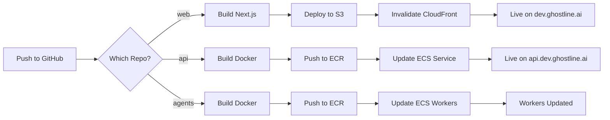

# GhostLine Deployment Guide

## Overview

This guide explains how automatic deployments work for the GhostLine platform. Every push to the `main` branch automatically deploys changes to dev.ghostline.ai.

## Current Architecture

### Web Frontend (Next.js)
- **Deployment Target**: S3 + CloudFront
- **URL**: https://dev.ghostline.ai
- **Trigger**: Push to `main` branch in `web` repository

### API Backend (FastAPI)
- **Deployment Target**: ECS Fargate (pending setup)
- **URL**: https://api.dev.ghostline.ai (pending)
- **Trigger**: Push to `main` branch in `api` repository

### Agents (LangGraph)
- **Deployment Target**: ECS Fargate as workers (pending setup)
- **Trigger**: Push to `main` branch in `agents` repository

## Setting Up Automatic Deployments

### 1. Web Frontend - Already Configured ✅

The web frontend automatically deploys on every push to main:

1. **GitHub Actions Workflow**: `.github/workflows/deploy.yml`
2. **Process**:
   - Builds Next.js application
   - Syncs to S3 bucket
   - Invalidates CloudFront cache
   - Site updates within 5-10 minutes

### 2. Configure GitHub Secrets

You need to add these secrets to each repository:

```bash
# In each repository settings -> Secrets and variables -> Actions
AWS_ACCESS_KEY_ID=<your-access-key>
AWS_SECRET_ACCESS_KEY=<your-secret-key>
```

### 3. API Backend - Setup Required

To enable automatic API deployments:

1. **Deploy ECS Infrastructure** (one-time setup):
```bash
cd ghostline/infra/terraform/environments/dev
# Add ECS module to main.tf
# Run: terraform apply
```

2. **Create API Deployment Workflow**:
```yaml
# api/.github/workflows/deploy.yml
name: Deploy API to ECS

on:
  push:
    branches: [ main ]

jobs:
  deploy:
    runs-on: ubuntu-latest
    steps:
      # Build and push to ECR
      # Update ECS service with new image
```

### 4. Agents - Setup Required

Similar to API, needs ECS infrastructure and deployment workflow.

## Manual Deployment

If you need to deploy manually:

### Web Frontend
```bash
cd ghostline/infra
./deploy-web.sh
```

### API (when ECS is set up)
```bash
# Update task definition
aws ecs update-service --cluster ghostline-dev --service api --force-new-deployment
```

## Deployment Flow



## Monitoring Deployments

### GitHub Actions
- Check Actions tab in each repository
- Green checkmark = successful deployment
- Red X = deployment failed

### AWS Console
- **CloudFront**: Check invalidation status
- **S3**: Verify files uploaded
- **ECS**: Check service deployment status
- **CloudWatch**: View application logs

## Rollback Procedures

### Web Frontend
1. Find previous successful GitHub Action run
2. Note the commit SHA
3. Revert to that commit:
```bash
git revert <commit-sha>
git push origin main
```

### API/Agents (when using ECS)
1. ECS keeps previous task definitions
2. Update service to use previous version:
```bash
aws ecs update-service --cluster ghostline-dev --service api --task-definition <previous-version>
```

## Cost Optimization

- **S3**: Minimal cost (~$0.023/GB/month)
- **CloudFront**: Pay per request (~$0.085/10,000 requests)
- **ECS Fargate**: Pay per vCPU/hour (~$0.04/vCPU/hour)
- **ECR**: $0.10/GB/month for storage

## Security Considerations

1. **GitHub Secrets**: Never commit AWS credentials
2. **IAM Permissions**: Use least privilege access
3. **HTTPS Only**: All services use SSL/TLS
4. **WAF Protection**: CloudFront protected by AWS WAF

## Next Steps

1. **Set up OIDC**: Replace AWS access keys with GitHub OIDC
2. **Add Staging**: Create staging environment
3. **Add Tests**: Run tests before deployment
4. **Add Notifications**: Slack/email on deployment status

## Troubleshooting

### Web Deployment Fails
- Check GitHub Actions logs
- Verify AWS credentials are correct
- Check S3 bucket permissions
- Verify CloudFront distribution ID

### Changes Not Showing
- CloudFront cache can take 5-10 minutes
- Check invalidation completed
- Try hard refresh (Ctrl+Shift+R)
- Check correct S3 files uploaded

### API Deployment Issues
- Check ECS task logs in CloudWatch
- Verify security groups allow traffic
- Check health check endpoint
- Verify database connection

---

For questions or issues, check the runbooks in `docs/runbooks/` or contact the platform team.

<!-- Data layer checkpoint: 2025-06-29 02:38 UTC --> 